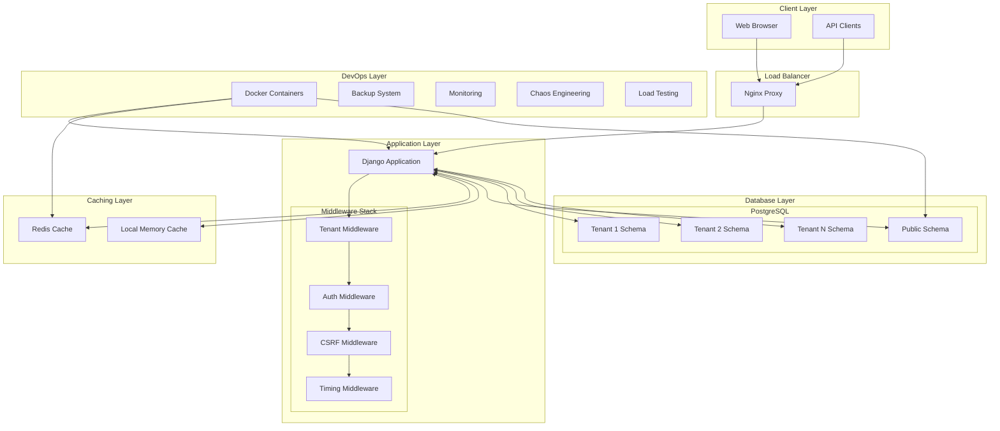
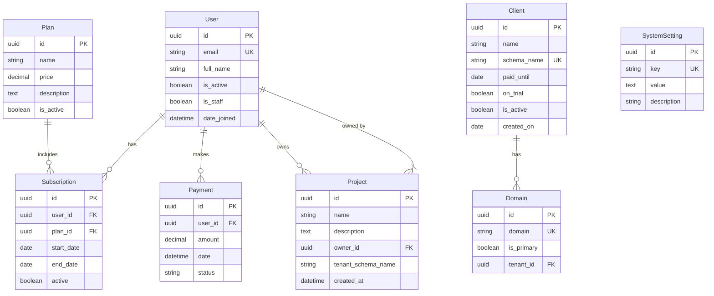
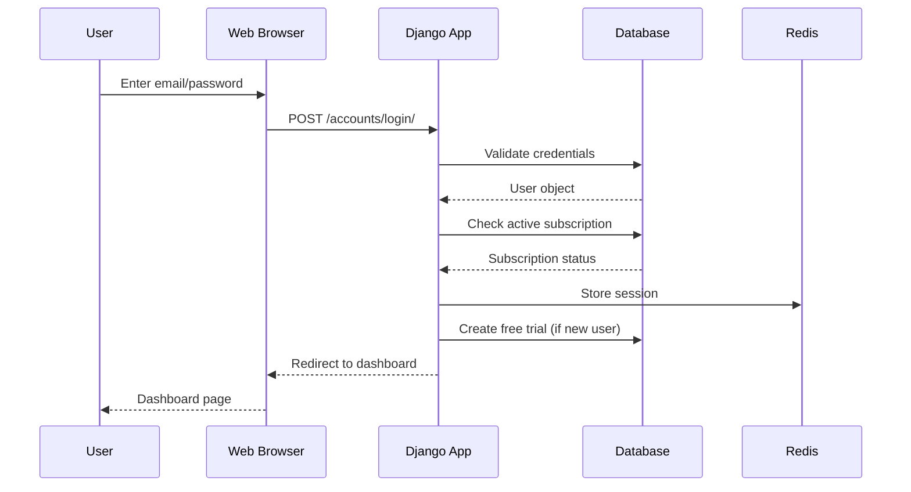

# 🏗️ System Design - Multi-Tenant SaaS Boilerplate

## Overview

This document provides a comprehensive system design overview of the Multi-Tenant SaaS Boilerplate, detailing the architecture, components, data flow, and design decisions that enable scalable multi-tenant applications.

## Table of Contents

- [Architecture Overview](#architecture-overview)
- [Multi-Tenancy Strategy](#multi-tenancy-strategy)
- [Data Architecture](#data-architecture)
- [Application Components](#application-components)
- [Authentication & Authorization](#authentication--authorization)
- [Caching Strategy](#caching-strategy)
- [Performance Optimizations](#performance-optimizations)
- [DevOps & Infrastructure](#devops--infrastructure)
- [Security Considerations](#security-considerations)
- [Scalability & Load Handling](#scalability--load-handling)
- [Monitoring & Observability](#monitoring--observability)
- [Development Workflow](#development-workflow)

---

## Architecture Overview

### High-Level Architecture



### Technology Stack

| Layer | Technology | Purpose |
|-------|------------|---------|
| **Framework** | Django 5.1+ | Web application framework |
| **Multi-Tenancy** | django-tenants | Schema-based tenant isolation |
| **Database** | PostgreSQL 14+ | Primary data storage with schema support |
| **Caching** | Redis 7 / LocMem | Session storage and performance caching |
| **Authentication** | django-allauth | Email-based authentication system |
| **Frontend** | Bootstrap 5 + Chart.js | Responsive UI with data visualization |
| **API** | Django REST Framework | RESTful API endpoints |
| **Containerization** | Docker + Docker Compose | Development and deployment |
| **Proxy** | Nginx | Reverse proxy and static file serving |
| **Testing** | Locust | Load testing and performance validation |

---

## Multi-Tenancy Strategy

### Schema-Based Isolation

The system implements **true multi-tenancy** using PostgreSQL schemas, providing complete data isolation between tenants while sharing application logic.

```sql
-- Example schema structure
CREATE SCHEMA public;     -- Shared data (users, tenants, billing)
CREATE SCHEMA tenant1;    -- Tenant-specific data
CREATE SCHEMA tenant2;    -- Tenant-specific data
```

### Tenant Resolution

```python
# Middleware-based tenant resolution
class TenantMainMiddleware:
    def process_request(self, request):
        # 1. Extract subdomain from request
        # 2. Lookup tenant by domain
        # 3. Set database schema context
        # 4. Continue request processing
```

### Schema Distribution

| Schema Type | Contains | Access Pattern |
|-------------|----------|----------------|
| **Public** | Users, Tenants, Billing, Plans, System Settings | Global, cross-tenant |
| **Tenant** | Projects, Tenant-specific data | Isolated per tenant |

---

## Data Architecture

### Entity Relationship Diagram



### Database Indexes

```sql
-- Performance-critical indexes
CREATE INDEX idx_subscription_user_active ON subscription(user_id, active, end_date);
CREATE INDEX idx_payment_user_date ON payment(user_id, date DESC);
CREATE INDEX idx_user_email ON users_user(email);
CREATE UNIQUE INDEX idx_active_subscription_per_user ON subscription(user_id) 
    WHERE active = true;
```

---

## Application Components

### Django Apps Architecture

```
apps/
├── common/          # Shared utilities and system settings
│   ├── models.py    # SystemSetting, Abstract base models
│   ├── middleware.py # TimingMiddleware
│   ├── decorators.py # subscription_required
│   └── utils.py     # get_setting_cached, get_client_ip
├── users/           # User management and authentication
│   ├── models.py    # Custom User model
│   ├── forms.py     # Login/Register forms
│   └── views.py     # Auth views with subscription checks
├── tenants/         # Tenant and domain management
│   ├── models.py    # Client, Domain models
│   └── views.py     # Tenant CRUD operations
├── dashboard/       # Main application dashboard
│   ├── models.py    # Project model
│   └── views.py     # Analytics, dashboard, exports
├── billing/         # Subscription and payment management
│   ├── models.py    # Plan, Subscription, Payment
│   └── views.py     # Billing flows
└── shared_users/    # Cross-tenant user relationships
```

### URL Routing Structure

```python
# config/urls.py - Main URL configuration
urlpatterns = [
    path('admin/', admin.site.urls),
    path('accounts/', include('apps.users.urls')),        # Auth endpoints
    path('accounts/', include('allauth.urls')),           # Social auth
    path('', include('apps.dashboard.urls')),             # Dashboard (/)
    path('billing/', include('apps.billing.urls')),      # Billing (/billing/)
    path('tenants/', include('apps.tenants.urls')),      # Tenant mgmt (/tenants/)
    path('', include('apps.common.urls')),               # System settings
]
```

### View Layer Architecture

```python
# Example: Dashboard view with caching and tenant awareness
@login_required
@ensure_csrf_cookie
def dashboard_view(request):
    # Automatic tenant context via middleware
    schema_name = connection.schema_name
    
    # Cached KPI calculations
    cache_key = f"dashboard_kpis_{request.user.id}_{schema_name}"
    kpis = cache.get_or_set(cache_key, lambda: calculate_kpis(), 
                           settings.DASHBOARD_CACHE_TTL)
    
    # Optimized queries with select_related
    recent_projects = Project.objects.filter(owner=request.user)\
                            .select_related('owner')\
                            .order_by('-created_at')[:5]
    
    return render(request, 'dashboard/index.html', {
        'kpis': kpis,
        'recent_projects': recent_projects,
        'schema_name': schema_name,
    })
```

---

## Authentication & Authorization

### Custom User Model

```python
class User(AbstractBaseUser, PermissionsMixin):
    email = models.EmailField(unique=True)          # Primary identifier
    full_name = models.CharField(max_length=255)    # Display name
    is_active = models.BooleanField(default=True)   # Account status
    is_staff = models.BooleanField(default=False)   # Admin access
    
    USERNAME_FIELD = 'email'  # Email-based login
    REQUIRED_FIELDS = []      # No additional required fields
```

### Authentication Flow



### Permission System

```python
# Subscription-based access control
@subscription_required
def premium_feature_view(request):
    # Only accessible with active subscription
    pass

# Staff-only access
@login_required
@user_passes_test(lambda u: u.is_staff)
def admin_feature_view(request):
    # Only accessible to staff users
    pass
```

---

## Caching Strategy

### Multi-Level Caching

```python
# 1. Application-level caching
CACHES = {
    'default': {
        'BACKEND': 'django.core.cache.backends.redis.RedisCache',
        'LOCATION': 'redis://redis:6379/1',
        'TIMEOUT': 300,
    }
}

# 2. View-level caching with tenant awareness
@cache_page(60 * 5)  # Cache for 5 minutes
def tenant_analytics_view(request):
    pass

# 3. Model-level caching
def get_setting_cached(key, default=None):
    cache_key = f"system_setting_{key}"
    value = cache.get(cache_key)
    if value is None:
        # Database fallback
        value = SystemSetting.objects.filter(key=key).value
        cache.set(cache_key, value, timeout=600)
    return value
```

### Cache Invalidation Strategy

```python
# Cache keys include tenant context
cache_key = f"dashboard_kpis_{user_id}_{schema_name}"

# Automatic invalidation on model changes
@receiver(post_save, sender=Subscription)
def invalidate_user_cache(sender, instance, **kwargs):
    cache_pattern = f"dashboard_kpis_{instance.user_id}_*"
    cache.delete_pattern(cache_pattern)
```

---

## Performance Optimizations

### Database Optimizations

1. **Strategic Indexing**
   ```sql
   -- High-traffic query optimization
   CREATE INDEX idx_subscription_user_active 
   ON subscription(user_id, active, end_date);
   
   -- Analytics query optimization
   CREATE INDEX idx_payment_date_user 
   ON payment(date DESC, user_id);
   ```

2. **Query Optimization**
   ```python
   # Use select_related for foreign keys
   payments = Payment.objects.select_related('user')\
                            .filter(date__gte=start_date)\
                            .only('amount', 'date', 'user__email')
   
   # Use prefetch_related for reverse foreign keys
   users = User.objects.prefetch_related('subscriptions')\
                      .filter(is_active=True)
   ```

3. **Database Constraints**
   ```python
   # Ensure data integrity at database level
   class Meta:
       constraints = [
           models.UniqueConstraint(
               fields=['user'],
               condition=models.Q(active=True),
               name='unique_active_subscription_per_user'
           )
       ]
   ```

### Application Optimizations

1. **Caching Strategy**
   - Dashboard KPIs: 2-minute cache
   - Analytics data: 5-minute cache
   - System settings: 10-minute cache

2. **Lazy Loading**
   ```python
   # Only load necessary data
   def dashboard_view(request):
       kpis = cache.get_or_set(
           f"kpis_{request.user.id}",
           lambda: calculate_kpis_efficiently(),
           timeout=120
       )
   ```

---

## DevOps & Infrastructure

### Container Architecture

```yaml
# docker-compose.yml
services:
  web:
    build: .
    command: sh -c "python manage.py migrate_schemas --shared && 
                   python manage.py runserver 0.0.0.0:8000"
    volumes:
      - .:/code
    depends_on:
      - db
      - redis
  
  db:
    image: postgres:14
    environment:
      POSTGRES_DB: multitenant_saas
      POSTGRES_INITDB_ARGS: "--data-checksums"
    volumes:
      - pgdata:/var/lib/postgresql/data
      - ./wal:/var/lib/postgresql/wal-archive  # WAL archiving
    healthcheck:
      test: ["CMD-SHELL", "pg_isready -U $$POSTGRES_USER"]
  
  redis:
    image: redis:7-alpine
    command: ["redis-server", "--appendonly", "yes"]
    volumes:
      - redisdata:/data
```

### Backup Strategy

1. **Full Database Backups**
   ```bash
   # Automated daily backups
   ./backup.sh full
   # Creates: full_backup_20231201_143022.sql.gz
   ```

2. **Schema-Specific Backups**
   ```bash
   # Per-tenant backups
   ./backup.sh schema tenant1
   # Creates: schema_tenant1_20231201_143022.sql.gz
   ```

3. **WAL Archiving**
   - Continuous transaction log backup
   - Point-in-time recovery capability
   - Stored in `./wal/` directory

### Testing Infrastructure

1. **Load Testing**
   ```python
   # Locust scenarios
   class AuthenticatedUser(HttpUser):
       weight = 2
       
       @task(5)
       def dashboard(self):
           self.client.get("/")
       
       @task(3)
       def analytics(self):
           self.client.get("/analytics/")
   ```

2. **Chaos Engineering**
   ```powershell
   # Random container restarts
   .\devops\chaos\docker-chaos.ps1 -DurationMinutes 5
   ```

---

## Security Considerations

### Multi-Tenant Data Isolation

1. **Schema-Level Isolation**
   - Complete database schema separation
   - No shared tables between tenants
   - Automatic schema routing via middleware

2. **Access Control**
   ```python
   # Middleware ensures tenant context
   class TenantMainMiddleware:
       def process_request(self, request):
           tenant = self.get_tenant(request)
           connection.set_schema(tenant.schema_name)
   ```

### Authentication Security

1. **Password Security**
   ```python
   # Django's built-in password hashing
   AUTH_PASSWORD_VALIDATORS = [
       'django.contrib.auth.password_validation.UserAttributeSimilarityValidator',
       'django.contrib.auth.password_validation.MinimumLengthValidator',
       'django.contrib.auth.password_validation.CommonPasswordValidator',
       'django.contrib.auth.password_validation.NumericPasswordValidator',
   ]
   ```

2. **CSRF Protection**
   ```python
   # CSRF middleware and tokens
   MIDDLEWARE = [
       'django.middleware.csrf.CsrfViewMiddleware',
   ]
   
   # Trusted origins for development
   CSRF_TRUSTED_ORIGINS = [
       'http://127.0.0.1:8000',
       'http://localhost:8000',
   ]
   ```

### Session Security

1. **Session Configuration**
   ```python
   # Secure session settings
   SESSION_COOKIE_SECURE = True    # HTTPS only (production)
   SESSION_COOKIE_HTTPONLY = True  # No JavaScript access
   SESSION_COOKIE_SAMESITE = 'Lax' # CSRF protection
   ```

---

## Scalability & Load Handling

### Horizontal Scaling

1. **Database Scaling**
   - Read replicas for analytics queries
   - Connection pooling with pgbouncer
   - Partitioning for large tenant schemas

2. **Application Scaling**
   ```yaml
   # Multiple app instances
   services:
     web1:
       <<: *web-service
     web2:
       <<: *web-service
     web3:
       <<: *web-service
     
     nginx:
       # Load balancer configuration
       upstream web {
         server web1:8000;
         server web2:8000;
         server web3:8000;
       }
   ```

### Caching Scaling

1. **Redis Cluster**
   ```yaml
   # Redis cluster for high availability
   services:
     redis-1:
       image: redis:7-alpine
     redis-2:
       image: redis:7-alpine
     redis-3:
       image: redis:7-alpine
   ```

2. **CDN Integration**
   ```python
   # Static file serving via CDN
   STATICFILES_STORAGE = 'whitenoise.storage.CompressedManifestStaticFilesStorage'
   ```

### Performance Metrics

| Metric | Target | Current |
|--------|--------|---------|
| Response Time (95th percentile) | < 200ms | Measured via load tests |
| Database Queries per Request | < 10 | Optimized with select_related |
| Cache Hit Rate | > 80% | Monitored via Redis metrics |
| Concurrent Users | 1000+ | Validated with Locust |

---

## Monitoring & Observability

### Performance Monitoring

1. **Request Timing**
   ```python
   class TimingMiddleware:
       def __call__(self, request):
           start = time.time()
           response = self.get_response(request)
           duration = time.time() - start
           print(f"⏱️ Request to {request.path} took {duration:.2f}s")
           return response
   ```

2. **Database Monitoring**
   ```sql
   -- Query performance analysis
   SELECT query, calls, total_time, mean_time 
   FROM pg_stat_statements 
   ORDER BY total_time DESC;
   ```

### Error Tracking

1. **Django Logging**
   ```python
   LOGGING = {
       'version': 1,
       'handlers': {
           'file': {
               'level': 'ERROR',
               'class': 'logging.FileHandler',
               'filename': 'django_errors.log',
           },
       },
       'root': {
           'handlers': ['file'],
       },
   }
   ```

### Health Checks

1. **Database Health**
   ```bash
   # Container health check
   healthcheck:
     test: ["CMD-SHELL", "pg_isready -U $$POSTGRES_USER"]
     interval: 5s
     timeout: 5s
     retries: 5
   ```

---

## Development Workflow

### Local Development Setup

```bash
# 1. Start infrastructure
docker compose -f devops/docker/docker-compose.yml up -d

# 2. Run migrations
python manage.py migrate_schemas --shared

# 3. Create superuser
python manage.py createsuperuser

# 4. Create test tenant
python manage.py create_tenant --name "Test Company" --schema "test"
```

### Testing Workflow

```bash
# 1. Unit tests
python manage.py test

# 2. Load testing
.\devops\loadtest\run_tests.ps1 -Scenario smoke

# 3. Chaos testing
.\devops\chaos\docker-chaos.ps1 -DurationMinutes 2
```

### Deployment Pipeline

1. **Development** → Local Docker environment
2. **Testing** → Automated load and chaos testing
3. **Staging** → Production-like environment
4. **Production** → Blue-green deployment

---

## API Design

### RESTful Endpoints

```python
# Tenant-aware API design
class ProjectViewSet(viewsets.ModelViewSet):
    serializer_class = ProjectSerializer
    permission_classes = [IsAuthenticated]
    
    def get_queryset(self):
        # Automatic tenant filtering via schema context
        return Project.objects.filter(owner=self.request.user)
    
    def perform_create(self, serializer):
        # Associate with current tenant schema
        serializer.save(
            owner=self.request.user,
            tenant_schema_name=connection.schema_name
        )
```

### API Versioning

```python
# URL-based versioning
urlpatterns = [
    path('api/v1/', include('api.v1.urls')),
    path('api/v2/', include('api.v2.urls')),
]
```

---

## Future Enhancements

### Planned Features

1. **Advanced Analytics**
   - Real-time dashboard updates
   - Custom reporting engine
   - Data export in multiple formats

2. **API Improvements**
   - GraphQL endpoint
   - Webhook system
   - Rate limiting

3. **Infrastructure**
   - Kubernetes deployment
   - Auto-scaling policies
   - Advanced monitoring with Prometheus

4. **Security**
   - Two-factor authentication
   - Advanced audit logging
   - SOC 2 compliance

---

## Conclusion

This Multi-Tenant SaaS Boilerplate provides a robust, scalable foundation for building enterprise-grade SaaS applications. The schema-based multi-tenancy approach ensures complete data isolation while maintaining shared application logic, and the comprehensive DevOps infrastructure supports both development and production deployment scenarios.

The architecture is designed to handle growth from startup to enterprise scale, with clear patterns for horizontal scaling, performance optimization, and operational excellence.
